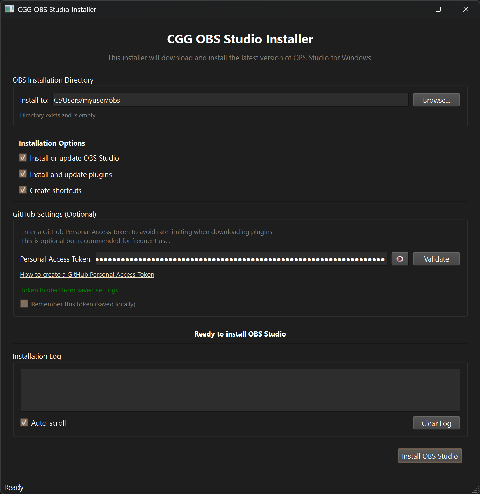

# Chaotic Good Gaming OBS Studio Installer

A Python 3.13 application with a Qt6 GUI for downloading and installing OBS Studio and a curated set of plugins on Windows.



## Overview

This tool provides a simple graphical interface to download and install OBS Studio and more than a dozen essential plugins. It automates the process of finding the latest versions, downloading them, and extracting them to the correct locations. It is designed to be a "one-click" solution for setting up a feature-rich OBS Studio environment.

## Features

<details>
<summary><strong>Click to expand the detailed feature list</strong></summary>

### Smart Version Management
- Checks GitHub for the latest stable release of OBS Studio.
- Compares with the locally installed version to avoid unnecessary downloads.
- Caches downloaded archives to speed up re-installations.

### Robust Download System
- Resumes interrupted downloads.
- Provides real-time download progress.
- Automatically retries failed downloads with exponential backoff.

### Intelligent Extraction
- Extracts `.zip` and `.7z` archives.
- Handles the nested directory structure of OBS Studio and its plugins.
- Installs plugins to the correct OBS Studio installation folder.

### Plugin Management
- Installs OBS Studio and 14 pre-configured plugins from GitHub and the OBS Project website.
- Tracks downloaded plugin versions to avoid re-downloading.
- Can automatically clean up old plugin archives.

### Customization and Configuration
- Create desktop and Start Menu shortcuts with custom icons.
- Persistently saves user preferences (e.g., installation path, window size).
- Supports using a GitHub token to avoid rate-limiting.
- Configuration is stored at `%USERPROFILE%\obs-installer\obs_installer_config.ini`.
- Logs are stored at `%USERPROFILE%\obs-installer\obs_installer.log`.

</details>

## Using the pre-built release
- Download and extract the latest pre-built installer archive from [here](https://github.com/Spafbi/cgg-obs/releases/latest/download/cgg-obs.zip)
- Execute `OBS_Installer.exe` from the release

<details>
<summary><strong>Build Requirements</strong></summary>

## Build Requirements
This section is for those who wish to directly execute or tinker with the Python code

- **Python 3.13**
- **Windows** operating system
- An active internet connection

## Usage

1.  **Clone the repository:**
    ```bash
    git clone https://github.com/spafbi/cgg-obs
    cd cgg-obs
    ```

2.  **Install dependencies:**
    ```bash
    pip install -r requirements.txt
    ```

3.  **Run the installer:**
    You can run the application in three ways:

    -   **Batch file (easiest):**
        Double-click on `install_obs.bat`.

    -   **Python script:**
        ```bash
        python run_installer.py
        ```

    -   **As an installed package (untested):**
        ```bash
        pip install -e .
        obs-installer
        ```

4.  **Using the Application:**
    -   Launch the installer.
    -   Select an installation location (defaults to `%USERPROFILE%\obs`).
    -   Choose the components to install (OBS, plugins, shortcuts).
    -   Click "Install OBS Studio".
    -   Follow the on-screen instructions to select a shortcut icon.

## Building the Installer

To build a standalone `.exe` installer, run the `build_installer.bat` script. This uses PyInstaller to package the application and its dependencies into a single executable. The output will be in the `dist` folder. It is highly suggested to run this from within a pipenv environment.

## Project Structure

```
obs_installer/
├── core/         # Core logic (installer, config, GitHub client)
├── ui/           # PyQt6 user interface components
└── utils/        # Utility functions (downloader, extractor, etc.)
```

## License

This project is licensed under the MIT License - see the [LICENSE](LICENSE) file for details.

## Acknowledgments

This project is made possible by the developers and communities behind OBS Studio and the many open-source libraries used, including PyQt6, Requests, and others listed in the `requirements.txt` file.
